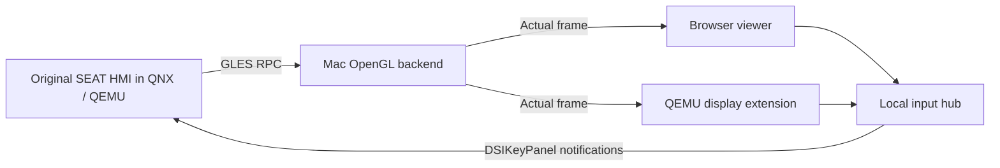

# MIB2 QNX on macOS

Run the original **SEAT MIB2 Standard HMI** inside an ARM QNX guest in QEMU.
The original HMI's GLES commands execute on a macOS OpenGL backend. This is an
experimental emulator integration, not a replacement infotainment UI.

**Verified:** the original SEAT radio screen renders with text, frequency,
preset tiles, and controls. **In progress:** native QEMU window integration,
touch, hardware buttons, and rotary encoders. A visible screen does not yet
mean every function works. See [current status](docs/STATUS.md).

## Tested configuration

| Component | Tested configuration |
| --- | --- |
| Head-unit family | TechniSat/PREH MIB2 Standard ZR, EU, SEAT Navi 6P0 |
| Firmware train | `MST2_EU_SE_ZR_P0480T` (MU 0480) |
| HMI version reported by the guest | `H29.319.120_STD2Nav_EU` |
| Skin reported by the guest | `SEAT_STD_SKIN_NORMAL_80_S-STD2Nav_EU-4` |
| Host | Apple Silicon Mac, Apple M4 Pro |
| Emulator | QEMU 11.1.0, `sabrelite`, Cortex-A9, 2 vCPUs, 1 GiB RAM |
| Cross compiler | QNX 6.5 ARMv7 toolchain in `ghcr.io/frida/qnx-tools:latest` |
| Build-container runtime | Docker through an x86 Colima VM |
| Host rendering | Native macOS CGL/OpenGL, offscreen 800 × 480 |
| Storage used during research | Community VW MIB2 eMMC image plus separately supplied SEAT P0480T HMI |

The research unit had previously been updated from P0468T to P0480T. Earlier
activation changes are not implemented or distributed here. Other firmware
trains and arbitrary eMMC images are **not** validated by these scripts.

## Obtain your own firmware and supporting files

**No firmware, eMMC dump, proprietary library, font, or SDK header is included.**

Start with the [MIB-Helper page for MST2_EU_SE_ZR_P0480T](https://mib-helper.com/index.php?train=MST2_EU_SE_ZR_P0480T#details).
Its firmware-download section links to external providers; MIB-Helper itself
does not host firmware. Use the exact tested train for this experiment.

A firmware update archive alone is not the complete, currently tested setup.
You also need a compatible QNX filesystem/eMMC extraction and the matching
J9 JNI headers. The working experiment used a community VW eMMC image; this
repository does not identify a verified public download source for that dump.
If obtaining files from your own unit, the independent
[MIB STD2 Toolbox](https://github.com/olli991/mib-std2-pq-zr-toolbox) provides
export tools. Its exports are not automatically equivalent to the raw disk
layout expected by this project.

Supply only files you are entitled to use. This project operates on emulator
copies and does not require flashing the car. See [local input layout](docs/SETUP.md).

## Local files used by the starter

Keep private inputs in `local-data/` in the project directory. This entire folder
is excluded from Git. The current workspace contains:

```text
local-data/
  firmware/MST2_EU_SE_ZR_P0480T.7z
  emmc/emmc.img
  emmc/eMMC_VW_EU_ZR_P0480T_CM_patched.7z
  maps/STD2_2510_EU1_202525.zip
  maps/navigation-sd.img
  patches/SE_ZR_P0480T_FEC_ALL_CID_OFF_CP_OFF_SPORT_FIXED.7z
  runtime/cpu-qemu-debug.ifs
  runtime/emmc-overlay.qcow2
```

| File | Purpose / requirement |
| --- | --- |
| `firmware/MST2_EU_SE_ZR_P0480T.7z` | Original tested SEAT firmware archive; used for preparation/rebuilding. |
| `emmc/emmc.img` | Unpacked compatible raw eMMC dump; required as the prepared disk's backing file. |
| `emmc/eMMC_VW_EU_ZR_P0480T_CM_patched.7z` | Archive used in this experiment; optional after the raw dump is extracted. |
| `maps/STD2_2510_EU1_202525.zip` | Supplied navigation map archive. Source for the virtual SD card; not yet verified in the navigation engine. |
| `maps/navigation-sd.img` | Generated FAT32 SD card. Automatically attached when present; QNX card/metadata reading verified, navigation engine integration still in progress. |
| `patches/SE_ZR_P0480T_FEC_ALL_CID_OFF_CP_OFF_SPORT_FIXED.7z` | Optional user-supplied patch, stored for inspection. Not automatically applied. |
| `runtime/cpu-qemu-debug.ifs` | Generated emulator boot image; required to start. |
| `runtime/emmc-overlay.qcow2` | Generated, prepared emulator disk; required to start. Its backing path is `../emmc/emmc.img`. |

Run `./start-mib.command`. It loads the two prepared files from
`local-data/runtime/`; QEMU reads the raw dump through the disk's backing path.
Archives are preparation inputs: startup does **not** extract multi-gigabyte
archives or rebuild the emulator on every run. Copying archives alone into a
fresh checkout does not replace the preparation/build steps in
[SETUP.md](docs/SETUP.md). The current workspace already has prepared boot files.

Prepare the map card once (requires `brew install mtools` and space for both
extraction and the generated card):

```sh
python scripts/prepare_map_card.py local-data/maps/STD2_2510_EU1_202525.zip
```

This checks ZIP CRCs, builds a 16 GiB sparse FAT32 image and reads back the map
metadata and database root. It refuses to overwrite an existing card. On startup,
QEMU uses a temporary write overlay to preserve the prepared card. Override its
location with `MIB_MAP_IMAGE`; set `MIB_MAP_IMAGE=` to skip attaching it.
An attached readable card does not yet establish a working navigation menu.

Set `MIB_DATA_DIR=/absolute/path/to/local-data` to use another input folder.
`MIB_CPU_IMAGE` and `MIB_EMMC_IMAGE` override individual boot files. Older
workspaces without either prepared local-data file retain the legacy generated
paths. Compatible snapshot selection still follows the rules below.

## Build and run

Requires Python 3.12+, QEMU including `qemu-img`/`qemu-io`, Docker, and a locally
available QNX toolchain container. Native window builds additionally need Xcode
Command Line Tools, Ninja, pkg-config, GLib, Pixman, and libslirp.

```sh
python3 -m venv .venv
. .venv/bin/activate
python -m pip install -r requirements.txt
export DOCKER_CONTEXT=colima-x86  # change to your own local Docker context
python scripts/doctor.py
```

Place your files as described in [SETUP.md](docs/SETUP.md), then:

```sh
make guest
```

Start everything in one terminal (requires the custom QEMU build below):

```sh
./start-mib.command
```

Press **Ctrl+C in that terminal** to stop QEMU, the viewer and the renderer.
Alternatively run `./stop-mib.command`. Repeated Ctrl+C does not interrupt cleanup.

The guest build prepares configuration and an HMI launch script once in the
local transfer image. Normal startup uses three console commands instead of
repeating configuration edits and diagnostic waits. A measured local run
completed startup commands in 52 seconds and produced menu frames at about
125 seconds; timings depend on the host. This is a cold boot, not a VM snapshot.
The viewer shows frame age; an old frame does not prove the guest is running.
Touch/button verification is tracked in [STATUS.md](docs/STATUS.md).

For the experimental **native QEMU window**, see [DISPLAY.md](qemu/DISPLAY.md).
The display extension uses real HMI readback; GLES rendering still runs on the
Mac backend. It does not emulate the original Vivante GPU.

## How it works



The guest uses emulator-specific RAM/storage fixes, a Screen/EGL adapter,
an empty persistence service, and simulated power state. Missing vehicle
services are not replaced with claimed working functionality. Audio, navigation,
CarPlay, real vehicle communication, and flashing are outside the verified result.

## Development and publishing

```sh
make check
```

The source audit rejects private inputs, binaries, raw logs, and local agent
notes in tracked files. `claude.md`, `agent.md`, `firmware/`, `extracted/`,
`reports/`, `vendor/`, and build outputs stay local. Never force-add them.

[GPL-2.0-or-later](LICENSE). See [third-party notices](NOTICE.md) and
[contribution guidelines](CONTRIBUTING.md).

## Run and capture a live snapshot

```sh
./start-mib.command
./capture-mib.command
```

Run `capture-mib.command` while QEMU is running. It briefly pauses the guest,
creates a standalone disk image containing RAM and device state under
`snapshots/`, then resumes the guest. The latest capture is recorded in
`snapshots/live.json`. Snapshot files contain local firmware/runtime data and
must not be published.

The starter tries the latest snapshot when its QEMU build matches, unless that
capture is marked as having failed a restore test. Known failed captures are skipped.
It uses a private APFS clone, preserving the saved image. Without a compatible
snapshot it boots normally. To explicitly ignore a snapshot:

```sh
MIB_COLD_BOOT=1 ./start-mib.command
```

**Live restore is experimental:** the Mac graphics context is external to QEMU.
A successful capture does not yet establish working graphics and input after
restore. The current captured image failed a fresh-process restore test and is
therefore skipped. Use a cold boot if restoration does not produce a responsive menu.
Ctrl+C in the startup terminal, or `./stop-mib.command`, stops the session.
