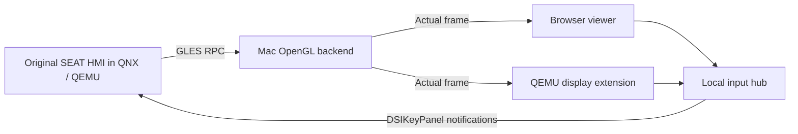

# MIB2 QNX on macOS

Run the original **SEAT MIB2 Standard HMI** inside an ARM QNX guest in QEMU.
The original HMI's GLES commands execute on a macOS OpenGL backend. This is an
experimental emulator integration, not a replacement infotainment UI.

**Verified:** the original SEAT radio screen renders with text, frequency,
preset tiles, and controls. **In progress:** native QEMU window integration,
touch, hardware buttons, and rotary encoders. A visible screen does not yet
mean every function works. See [current status](docs/STATUS.md).

## Tested configuration

| Component | Tested configuration |
| --- | --- |
| Head-unit family | TechniSat/PREH MIB2 Standard ZR, EU, SEAT Navi 6P0 |
| Firmware train | `MST2_EU_SE_ZR_P0480T` (MU 0480) |
| HMI version reported by the guest | `H29.319.120_STD2Nav_EU` |
| Skin reported by the guest | `SEAT_STD_SKIN_NORMAL_80_S-STD2Nav_EU-4` |
| Host | Apple Silicon Mac, Apple M4 Pro |
| Emulator | QEMU 11.1.0, `sabrelite`, Cortex-A9, 2 vCPUs, 1 GiB RAM |
| Cross compiler | QNX 6.5 ARMv7 toolchain in `ghcr.io/frida/qnx-tools:latest` |
| Build-container runtime | Docker through an x86 Colima VM |
| Host rendering | Native macOS CGL/OpenGL, offscreen 800 × 480 |
| Storage used during research | Community VW MIB2 eMMC image plus separately supplied SEAT P0480T HMI |

The research unit had previously been updated from P0468T to P0480T. Earlier
activation changes are not implemented or distributed here. Other firmware
trains and arbitrary eMMC images are **not** validated by these scripts.

## Obtain your own firmware and supporting files

**No firmware, eMMC dump, proprietary library, font, or SDK header is included.**

Start with the [MIB-Helper page for MST2_EU_SE_ZR_P0480T](https://mib-helper.com/index.php?train=MST2_EU_SE_ZR_P0480T#details).
Its firmware-download section links to external providers; MIB-Helper itself
does not host firmware. Use the exact tested train for this experiment.

A firmware update archive alone is not the complete, currently tested setup.
You also need a compatible QNX filesystem/eMMC extraction and the matching
J9 JNI headers. The working experiment used a community VW eMMC image; this
repository does not identify a verified public download source for that dump.
If obtaining files from your own unit, the independent
[MIB STD2 Toolbox](https://github.com/olli991/mib-std2-pq-zr-toolbox) provides
export tools. Its exports are not automatically equivalent to the raw disk
layout expected by this project.

Supply only files you are entitled to use. This project operates on emulator
copies and does not require flashing the car. See [local input layout](docs/SETUP.md).

## Build and run

Requires Python 3.12+, QEMU including `qemu-img`/`qemu-io`, Docker, and a locally
available QNX toolchain container. Native window builds additionally need Xcode
Command Line Tools, Ninja, pkg-config, GLib, Pixman, and libslirp.

```sh
python3 -m venv .venv
. .venv/bin/activate
python -m pip install -r requirements.txt
export DOCKER_CONTEXT=colima-x86  # change to your own local Docker context
python scripts/doctor.py
```

Place your files as described in [SETUP.md](docs/SETUP.md), then:

```sh
make guest
```

Start the viewer and renderer in separate terminals:

```sh
make viewer       # http://127.0.0.1:8767/
make renderer    # local GLES bridge on port 8768
```

Start the original guest with input support:

```sh
python scripts/probe_qemu.py \
  --commands-file qemu/seat-native-input-probe.commands \
  --report reports/interactive-guest.log \
  --command-timeout 240 --keep-running
```

The first boot/mount/start sequence takes several minutes. The viewer explicitly
shows the age of the most recent frame; an old frame does not prove the guest
is still running. Touch/button work is tracked in [STATUS.md](docs/STATUS.md).

For the experimental **native QEMU window**, see [DISPLAY.md](qemu/DISPLAY.md).
The display extension uses real HMI readback; GLES rendering still runs on the
Mac backend. It does not emulate the original Vivante GPU.

## How it works



The guest uses emulator-specific RAM/storage fixes, a Screen/EGL adapter,
an empty persistence service, and simulated power state. Missing vehicle
services are not replaced with claimed working functionality. Audio, navigation,
CarPlay, real vehicle communication, and flashing are outside the verified result.

## Development and publishing

```sh
make check
```

The source audit rejects private inputs, binaries, raw logs, and local agent
notes in tracked files. `claude.md`, `agent.md`, `firmware/`, `extracted/`,
`reports/`, `vendor/`, and build outputs stay local. Never force-add them.

[GPL-2.0-or-later](LICENSE). See [third-party notices](NOTICE.md) and
[contribution guidelines](CONTRIBUTING.md).
